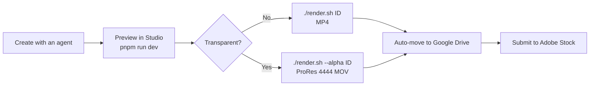

# Remotion Video UI Library

A library of video assets built with Remotion.

## Setup

Requirements: Node.js, pnpm, ffmpeg, rclone, and macOS with a GPU

```console
brew install ffmpeg rclone
pnpm i
cp .env.example .env
rclone config create gdrive drive scope=drive   # Log in to Google Drive in the browser
```

Set the output and upload destinations in `.env`.

| Variable | Description |
|---|---|
| `REMOTION_OUTPUT_DIR` | Output folder (defaults to `out/`) |
| `REMOTION_UPLOAD_REMOTE` | Upload destination (e.g. `gdrive:Videos/remotion`). No upload if unset |
| `REMOTION_UPLOAD` | Set to `0` to skip uploading |

rclone's shared client ID is being retired in 2026. Create [your own client ID](https://rclone.org/drive/#making-your-own-client-id) and set it with `rclone config update gdrive client_id=... client_secret=...`.

## Render



| Command | Description |
|---|---|
| `./render.sh <CompositionId>...` | Render the given compositions |
| `./render.sh --alpha <CompositionId>...` | Render as transparent MOV |
| `./render.sh --png-sequence [--transparent-bg] <CompositionId>` | Render as a PNG sequence |
| `./render.sh all` | Render all compositions |
| `./render.sh upload` | Move videos left in the output folder to Drive |
| `./render.sh help` | Other commands |

Output: `<output folder>/<Studio folder>/<CompositionId>/` (`-5s` variants go into the base composition's folder). Already-rendered compositions (including those on Drive) are skipped.

## Licence

[MIT](https://opensource.org/licenses/MIT)

## Author

[Asami.K](https://asami.tokyo/)
